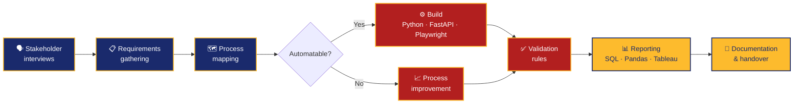

<!-- ══════════════ BANNER ══════════════ -->
<div align="center">


<!-- ══════════════ TYPING HEADLINE ══════════════ -->
<a href="https://github.com/jccontrerasg08-cpu">
  
</a>

<br/>

<!-- ══════════════ SOCIAL BADGES ══════════════ -->
<a href="https://linkedin.com/in/juan-carlos-c-a19132211/">
  
</a>
<a href="mailto:jccontrerasg08@gmail.com">
  
</a>
<a href="https://github.com/jccontrerasg08-cpu">
  
</a>


</div>

---

## About Me

**Business Analyst** and recent **Global Business** graduate (Tecnológico de Monterrey) working at the
intersection of **business processes, logistics, automation, and data**. I gather requirements from finance and
operations teams, document the workflows, and then build the automation that removes the manual work.

```yaml
name:         Juan Carlos Contreras Gastélum
alias:        Juca8
location:     Ensenada / Tijuana / Monterrey, México 🇲🇽
role:         Business Analyst · Logistics/Supply Chain · Data Analytics
education:    B.A. Global Business — Data Analytics & AI Tools (GPA 91.76/100)
exchange:     Vrije Universiteit Amsterdam 🇳🇱
languages:    Español (nativo) · English (bilingual, C1) · Français · Nederlands
focus:        Requirements gathering → workflow documentation → automation
```

- 🔭 Currently building **automated billing and customer-service workflows** with Python, FastAPI and Playwright.
- 🧾 Shipped **CFDI 4.0 electronic invoicing** with SAT sealing, PDF generation and email delivery.
- 🤖 Integrated the **WhatsApp Business API** and **Telegram Bot API** into production business flows.
- 📊 Comfortable across the full analytics workflow — **SQL → Pandas → Tableau**, following **CRISP-DM**.
- 🌍 Work effectively in **English and Spanish** with cross-functional teams.
- 📫 Reach me at **jccontrerasg08@gmail.com** or on [LinkedIn](https://linkedin.com/in/juan-carlos-c-a19132211/).

---

## Core Competencies

<div align="center">

`Business Process Analysis` · `Requirements Gathering` · `Stakeholder Management`
`Workflow Documentation` · `Business Reporting` · `Process Improvement`
`Data Analysis` · `Process Automation` · `Problem Solving` · `Cross-functional Collaboration`
`Financial Analysis` · `Accounting & Invoicing` · `Reconciliations` · `Inventory`
`Free Trade Agreements` · `Import / Export` · `Comercio Exterior`

</div>

---

## How I Work

*Rendered natively by GitHub — no external service, so it always loads.*



---

## Tech Stack

<div align="center">

### Data & Analytics


### Automation & Development


### Business & Enterprise Tools


</div>

---

## Experience

**Freelance Developer** · RFA — Tijuana / Ensenada, México · `02/2025 – Present`
> Analyzed business processes and gathered requirements from finance and operations teams, translating
> them into automation opportunities. Built automated workflows in **Python, FastAPI and Playwright**
> that cut manual processing time in billing and customer service. Implemented **CFDI 4.0 electronic
> invoicing** with SAT sealing, PDF generation and email delivery, plus **WhatsApp Business** and
> **Telegram** API integrations. Documented workflows, validation rules and integration procedures.

**Sponsorships Director** · Comité de Participación Estudiantil, Tec de Monterrey · `01/2025 – 06/2025`
> Led the sponsorships area, securing funding for charity events and student initiatives. Managed
> outreach, proposals and follow-up with local businesses, and presented financial results to the committee.

**Accounting Assistant** · RFA · `09/2019 – 01/2020`
> Processed invoices, journal entries and financial documentation. Supported monthly close through
> account reconciliations and financial data validation. Produced reports, workflow documentation and internal controls.

**Sales & Delivery Associate** · RFA · `01/2019 – 08/2019`
> Supported B2C deliveries, order processing and customer accounts across Ensenada and Tijuana.
> Managed route pickups and inventory control, and identified upsell opportunities with repeat customers.

---

## Education

<table>
<tr><td width="55%" valign="top">

**🏛️ Tecnológico de Monterrey (ITESM)**
`08/2022 – 06/2026`
Bachelor of Global Business
*Concentration: Data Analytics & AI Tools*
GPA **91.76 / 100** — 🏅 Beca Talento Académico
`Business Strategy` `Data Analytics` `International Trade` `Global Logistics`

**🌷 Vrije Universiteit Amsterdam**
`08/2025 – 01/2026`
Exchange Program — Business, Management & Negotiation
*24 ECTS · Advanced Negotiations · AI for Business · Data Structures & Algorithms*

</td><td width="45%" valign="top">


| Languages | Level |
| :--- | :--- |
| Español | Nativo |
| English | Bilingual · C1 (TOEFL / Cambridge) |
| Français | Basic |
| Nederlands | Basic |

</td></tr>
</table>

**Certifications** 

- **Google Data Analytics** — SQL, R, Tableau, end-to-end workflow
- **SAP Business Analyst** — data analytics & business-process analysis
- **McKinsey Forward Program** — leadership & structured problem-solving
- **Learn SQL Basics for Data Science** — UC Davis
- **Cadena de Suministro global** — supply chain & logistics
- **Comercio Internacional** — export, import, customs & global business


---


<div align="center">

<picture>
  <source
    media="(prefers-color-scheme: dark)"
    srcset="https://raw.githubusercontent.com/jccontrerasg08-cpu/jccontrerasg08-cpu/output/github-snake-dark.svg"
  />
  <source
    media="(prefers-color-scheme: light)"
    srcset="https://raw.githubusercontent.com/jccontrerasg08-cpu/jccontrerasg08-cpu/output/github-snake.svg"
  />
  
</picture>

</div>

<div align="center">
"Si resuelve un problema real, vale la pena construirlo."

**Open to Business Analyst, Data Analyst and Process Automation roles.**
📬 [jccontrerasg08@gmail.com](mailto:jccontrerasg08@gmail.com) · [LinkedIn](https://linkedin.com/in/juan-carlos-c-a19132211/)


</div>
